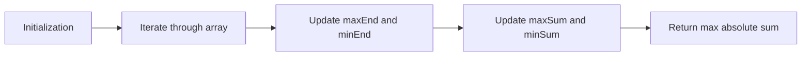

<h2><a href="https://leetcode.com/problems/maximum-absolute-sum-of-any-subarray">1749. Maximum Absolute Sum of Any Subarray</a></h2>

<p>You are given an integer array <code>nums</code>. The <strong>absolute sum</strong> of a subarray <code>[nums<sub>l</sub>, nums<sub>l+1</sub>, ..., nums<sub>r-1</sub>, nums<sub>r</sub>]</code> is <code>abs(nums<sub>l</sub> + nums<sub>l+1</sub> + ... + nums<sub>r-1</sub> + nums<sub>r</sub>)</code>.</p>

<p>Return <em>the <strong>maximum</strong> absolute sum of any <strong>(possibly empty)</strong> subarray of </em><code>nums</code>.</p>

<p>Note that <code>abs(x)</code> is defined as follows:</p>

<ul>
	<li>If <code>x</code> is a negative integer, then <code>abs(x) = -x</code>.</li>
	<li>If <code>x</code> is a non-negative integer, then <code>abs(x) = x</code>.</li>
</ul>

<p>&nbsp;</p>
<p><strong class="example">Example 1:</strong></p>

<pre><strong>Input:</strong> nums = [1,-3,2,3,-4]
<strong>Output:</strong> 5
<strong>Explanation:</strong> The subarray [2,3] has absolute sum = abs(2+3) = abs(5) = 5.
</pre>

<p><strong class="example">Example 2:</strong></p>

<pre><strong>Input:</strong> nums = [2,-5,1,-4,3,-2]
<strong>Output:</strong> 8
<strong>Explanation:</strong> The subarray [-5,1,-4] has absolute sum = abs(-5+1-4) = abs(-8) = 8.
</pre>

<p>&nbsp;</p>
<p><strong>Constraints:</strong></p>

<ul>
	<li><code>1 &lt;= nums.length &lt;= 10<sup>5</sup></code></li>
	<li><code>-10<sup>4</sup> &lt;= nums[i] &lt;= 10<sup>4</sup></code></li>
</ul>


---

# 🛍️ Maximum-Absolute-Sum-of-Any-Subarray | Explained

## Approach 1: Kadane's Algorithm for Maximum and Minimum Subarray Sums
### Intuition
The core idea behind this approach is to employ a modified version of Kadane's algorithm, which is typically used to find the maximum sum of a subarray. Here, we extend this concept to also track the minimum sum of a subarray. This intuition works because by keeping track of both the maximum and minimum ending sums at each position, we can efficiently calculate the maximum absolute sum of any subarray.

### Algorithm Visualized


### Approach
The high-level logic involves initializing variables to keep track of the maximum and minimum ending sums (`maxEnd` and `minEnd`) and the overall maximum and minimum sums (`maxSum` and `minSum`). Then, for each element in the array, we update `maxEnd` and `minEnd` based on whether including the current element increases or decreases their values. We subsequently update `maxSum` and `minSum` if `maxEnd` and `minEnd` have changed. Finally, we return the maximum of the absolute values of `maxSum` and `minSum`.

### Detailed Code Analysis
Let's break down the code:
- `int maxEnd = nums[0];` and `int minEnd = nums[0];`: Initialize `maxEnd` and `minEnd` with the first element of the array, as the maximum and minimum ending sums up to the first position are the element itself.
- `int maxSum = nums[0];` and `int minSum = nums[0];`: Similarly, initialize `maxSum` and `minSum` with the first element, representing the maximum and minimum sums seen so far.
- `for(int i = 1; i < n; i++)`: Iterate through the array starting from the second element (index 1).
- `maxEnd = max(nums[i], maxEnd + nums[i]);`: Update `maxEnd` to be the maximum of the current element (`nums[i]`) and the sum of `maxEnd` and the current element. This effectively decides whether to start a new subarray at the current position or extend the existing one.
- `maxSum = max(maxEnd, maxSum);`: Update `maxSum` if `maxEnd` is greater, indicating that we've found a new maximum sum.
- `minEnd = min(nums[i], nums[i] + minEnd);`: Update `minEnd` similarly, but for minimum sums. We consider starting a new subarray at the current position or extending the existing one based on which results in a smaller sum.
- `minSum = min(minEnd, minSum);`: Update `minSum` if `minEnd` is smaller, indicating a new minimum sum has been found.
- `return max(abs(minSum), abs(maxSum));`: Finally, return the maximum of the absolute values of `minSum` and `maxSum`, which represents the maximum absolute sum of any subarray.

### Code
```cpp
int maxAbsoluteSum(vector<int>& nums) {
    int n = nums.size();

    int maxEnd = nums[0];
    int minEnd = nums[0];
    int maxSum = nums[0];
    int minSum = nums[0];
    for(int i = 1; i < n; i++){
        maxEnd = max(nums[i], maxEnd + nums[i]);
        maxSum = max(maxEnd, maxSum);

        minEnd = min(nums[i], nums[i] + minEnd);
        minSum = min(minEnd, minSum);
    }
    return max(abs(minSum), abs(maxSum));
}
```

### Complexity
- **Time:** O(n), where n is the number of elements in the input array. This is because we perform a single pass through the array.
- **Space:** O(1), since we use a constant amount of space to store our variables (`maxEnd`, `minEnd`, `maxSum`, `minSum`, `n`, and `i`), regardless of the input size.