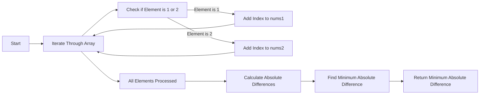

<h2><a href="https://leetcode.com/problems/minimum-absolute-difference-between-two-values">3880. Minimum Absolute Difference Between Two Values</a></h2>

<p>You are given an integer array <code>nums</code> consisting only of 0, 1, and 2.</p>

<p>A pair of indices <code>(i, j)</code> is called <strong>valid</strong> if <code>nums[i] == 1</code> and <code>nums[j] == 2</code>.</p>

<p>Return the <strong>minimum</strong> absolute difference between <code>i</code> and <code>j</code> among all valid pairs. If no valid pair exists, return -1.</p>

<p>The absolute difference between indices <code>i</code> and <code>j</code> is defined as <code>abs(i - j)</code>.</p>

<p>&nbsp;</p>
<p><strong class="example">Example 1:</strong></p>

<div class="example-block">
<p><strong>Input:</strong> <span class="example-io">nums = [1,0,0,2,0,1]</span></p>

<p><strong>Output:</strong> <span class="example-io">2</span></p>

<p><strong>Explanation:</strong></p>

<p>The valid pairs are:</p>

<ul>
	<li>(0, 3) which has absolute difference of <code>abs(0 - 3) = 3</code>.</li>
	<li>(5, 3) which has absolute difference of <code>abs(5 - 3) = 2</code>.</li>
</ul>

<p>Thus, the answer is 2.</p>
</div>

<p><strong class="example">Example 2:</strong></p>

<div class="example-block">
<p><strong>Input:</strong> <span class="example-io">nums = [1,0,1,0]</span></p>

<p><strong>Output:</strong> <span class="example-io">-1</span></p>

<p><strong>Explanation:</strong></p>

<p>There are no valid pairs in the array, thus the answer is -1.</p>
</div>

<p>&nbsp;</p>
<p><strong>Constraints:</strong></p>

<ul>
	<li><code>1 &lt;= nums.length &lt;= 100</code></li>
	<li><code>0 &lt;= nums[i] &lt;= 2</code></li>
</ul>


---

# 🛍️ Minimum-Absolute-Difference-Between-Two-Values | Explained

## Approach 1: Brute-Force Absolute Difference Calculation
### Intuition
The intuition behind this approach is to compare every index of value 1 with every index of value 2 in the input array, calculate the absolute difference between these indices, and keep track of the minimum difference found. This approach works because it exhaustively checks all possible pairs of indices, thus guaranteeing that the minimum absolute difference will be found.

### Algorithm Visualized


### Approach
The algorithm starts by iterating through the input array to separate the indices of values 1 and 2 into two separate vectors, `nums1` and `nums2`. After all elements have been processed, the algorithm then calculates the absolute differences between all pairs of indices from `nums1` and `nums2`, keeping track of the minimum absolute difference found.

### Detailed Code Analysis
Let's break down the code step-by-step:
- Lines 4-5: The size of the input array `nums` is obtained and stored in `n`.
- Lines 6-7: Two empty vectors, `nums1` and `nums2`, are declared to store the indices of values 1 and 2, respectively.
- Lines 9-19: The input array is iterated through. For each element, if the element is 1, its index is added to `nums1` (lines 10-11). If the element is 2, its index is added to `nums2` (lines 13-14). If the element is neither 1 nor 2, the loop continues to the next iteration (lines 16-18).
- Lines 20-22: The minimum absolute difference `minDiff` is initialized to `INT_MAX`, and the sizes of `nums1` and `nums2` are obtained.
- Lines 24-29: Checks are performed to ensure that both `nums1` and `nums2` are not empty. If either is empty, the function returns -1, indicating that there are not enough elements to calculate a difference.
- Lines 31-36: The code then enters a nested loop structure. The outer loop iterates through the indices in `nums1`, and the inner loop iterates through the indices in `nums2`. For each pair of indices, the absolute difference is calculated (line 33), and `minDiff` is updated if the calculated difference is smaller (line 34).
- Line 37: Finally, the minimum absolute difference found is returned.

### Code
```cpp
int minAbsoluteDifference(vector<int>& nums) {
    int n = nums.size();

    vector<int> nums1;
    vector<int> nums2;

    for(int i = 0; i < n; i++){
        if(nums[i] == 1){
            nums1.push_back(i);
        }
        else if(nums[i] == 2){
            nums2.push_back(i);
        }
        else{
            continue;
        }
    }
    int minDiff = INT_MAX;
    int size1 = nums1.size();
    int size2 = nums2.size();

    if(size1 == 0){
        return -1;
    }
    if(size2 == 0){
        return -1;
    }

    for(int i = 0; i < size1; i++){
        for(int j = 0; j < size2; j++){
            int diff = abs(nums1[i] - nums2[j]);
            minDiff = min(diff, minDiff);
        }
    }
    return minDiff;
}
```

### Complexity
- **Time:** The time complexity of this approach is O(n + size1 * size2), where n is the size of the input array, and size1 and size2 are the sizes of `nums1` and `nums2`, respectively. The initial iteration through the array takes O(n) time, and the nested loops take O(size1 * size2) time.
- **Space:** The space complexity is O(n), as in the worst-case scenario, all indices could be stored in either `nums1` or `nums2`, requiring additional space proportional to the size of the input array.

## 🕵️‍♂️ Follow-up Questions (Optional)
1. Q: How would you optimize this solution for very large input arrays?
A: One potential optimization could involve sorting the indices in `nums1` and `nums2` and then using a two-pointer technique to find the minimum absolute difference more efficiently. This approach could reduce the time complexity from O(size1 * size2) to O(size1 + size2) for the calculation of the minimum absolute difference.
2. Q: What if the input array contains values other than 1 and 2?
A: The current implementation ignores any values other than 1 and 2. To handle other values, modifications could be made to the conditionals that check for values 1 and 2, potentially involving additional vectors or logic to accommodate the different values.