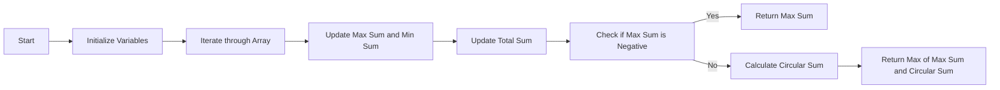

<h2><a href="https://leetcode.com/problems/maximum-sum-circular-subarray">918. Maximum Sum Circular Subarray</a></h2>

<p>Given a <strong>circular integer array</strong> <code>nums</code> of length <code>n</code>, return <em>the maximum possible sum of a non-empty <strong>subarray</strong> of </em><code>nums</code>.</p>

<p>A <strong>circular array</strong> means the end of the array connects to the beginning of the array. Formally, the next element of <code>nums[i]</code> is <code>nums[(i + 1) % n]</code> and the previous element of <code>nums[i]</code> is <code>nums[(i - 1 + n) % n]</code>.</p>

<p>A <strong>subarray</strong> may only include each element of the fixed buffer <code>nums</code> at most once. Formally, for a subarray <code>nums[i], nums[i + 1], ..., nums[j]</code>, there does not exist <code>i &lt;= k1</code>, <code>k2 &lt;= j</code> with <code>k1 % n == k2 % n</code>.</p>

<p>&nbsp;</p>
<p><strong class="example">Example 1:</strong></p>

<pre><strong>Input:</strong> nums = [1,-2,3,-2]
<strong>Output:</strong> 3
<strong>Explanation:</strong> Subarray [3] has maximum sum 3.
</pre>

<p><strong class="example">Example 2:</strong></p>

<pre><strong>Input:</strong> nums = [5,-3,5]
<strong>Output:</strong> 10
<strong>Explanation:</strong> Subarray [5,5] has maximum sum 5 + 5 = 10.
</pre>

<p><strong class="example">Example 3:</strong></p>

<pre><strong>Input:</strong> nums = [-3,-2,-3]
<strong>Output:</strong> -2
<strong>Explanation:</strong> Subarray [-2] has maximum sum -2.
</pre>

<p>&nbsp;</p>
<p><strong>Constraints:</strong></p>

<ul>
	<li><code>n == nums.length</code></li>
	<li><code>1 &lt;= n &lt;= 3 * 10<sup>4</sup></code></li>
	<li><code>-3 * 10<sup>4</sup> &lt;= nums[i] &lt;= 3 * 10<sup>4</sup></code></li>
</ul>


---

# 🛍️ Maximum-Sum-Circular-Subarray | Explained

## Approach 1: Kadane's Algorithm with Circular Array Extension
### Intuition
This approach works by using Kadane's algorithm to find the maximum sum of a subarray within the given array. However, since we're dealing with a circular array, we also need to consider the maximum sum that can be obtained by wrapping around the array. This is achieved by calculating the total sum of the array and subtracting the minimum sum of a subarray, which is also found using Kadane's algorithm. The intuition behind this is that if the maximum sum of a subarray is negative, then the maximum sum of the circular array is simply the maximum sum of a subarray. However, if the maximum sum of a subarray is positive, then we need to consider the maximum sum that can be obtained by wrapping around the array.

### Algorithm Visualized


### Approach
The approach involves the following steps:
1. Initialize variables to keep track of the maximum sum, minimum sum, and total sum.
2. Iterate through the array, updating the maximum sum and minimum sum using Kadane's algorithm.
3. Update the total sum by adding each element to it.
4. After iterating through the array, check if the maximum sum is negative. If it is, return the maximum sum.
5. If the maximum sum is not negative, calculate the circular sum by subtracting the minimum sum from the total sum.
6. Return the maximum of the maximum sum and the circular sum.

### Detailed Code Analysis
Let's break down the code:
- `int n = nums.size();`: This line gets the size of the input array.
- `int currentMin = 0;` and `int currentMax = 0;`: These lines initialize variables to keep track of the current minimum sum and maximum sum of a subarray.
- `int minSum = INT_MAX;` and `int maxSum = INT_MIN;`: These lines initialize variables to keep track of the minimum sum and maximum sum of a subarray seen so far.
- `int total = 0;`: This line initializes a variable to keep track of the total sum of the array.
- The `for` loop iterates through the array, updating the `currentMin`, `currentMax`, `minSum`, `maxSum`, and `total` variables at each step.
- `currentMin = min(currentMin + nums[i], nums[i]);`: This line updates the `currentMin` variable using Kadane's algorithm. It takes the minimum of the current minimum sum plus the current element, and the current element itself.
- `minSum = min(currentMin, minSum);`: This line updates the `minSum` variable by taking the minimum of the current minimum sum and the minimum sum seen so far.
- `currentMax = max(currentMax + nums[i], nums[i]);`: This line updates the `currentMax` variable using Kadane's algorithm. It takes the maximum of the current maximum sum plus the current element, and the current element itself.
- `maxSum = max(maxSum, currentMax);`: This line updates the `maxSum` variable by taking the maximum of the current maximum sum and the maximum sum seen so far.
- `total = total + nums[i];`: This line updates the `total` variable by adding the current element to it.
- `if (maxSum < 0)`: This line checks if the maximum sum is negative. If it is, the function returns the maximum sum.
- `int circular = total - minSum;`: This line calculates the circular sum by subtracting the minimum sum from the total sum.
- `return max(maxSum, circular);`: This line returns the maximum of the maximum sum and the circular sum.

### Code
```cpp
class Solution {
public:
    int maxSubarraySumCircular(vector<int>& nums) {
        int n = nums.size();

        int currentMin = 0;
        int currentMax = 0;

        int minSum = INT_MAX;
        int maxSum = INT_MIN;

        int total = 0;

        for(int i = 0; i < n; i++){
            currentMin = min(currentMin + nums[i], nums[i]);
            minSum = min(currentMin, minSum);

            currentMax = max(currentMax + nums[i], nums[i]);
            maxSum = max(maxSum, currentMax);

            total = total + nums[i];
        }

        if (maxSum < 0){
            return maxSum;
        }

        int circular = total - minSum;

        return max(maxSum, circular);
    }
};
```

### Complexity
- **Time:** The time complexity of this algorithm is O(n), where n is the size of the input array. This is because the algorithm iterates through the array once, performing constant-time operations at each step.
- **Space:** The space complexity of this algorithm is O(1), which means the space required does not grow with the size of the input array. This is because the algorithm only uses a constant amount of space to store the `currentMin`, `currentMax`, `minSum`, `maxSum`, and `total` variables. 

## 🕵️‍♂️ Follow-up Questions (Optional)
What would happen if the input array is empty? 
Answer: In this case, the function would return 0, because the maximum sum of an empty array is defined to be 0.

How can we extend this solution to handle 2D arrays?
Answer: To extend this solution to handle 2D arrays, we would need to modify the algorithm to consider all possible submatrices within the 2D array. This would involve using a similar approach to Kadane's algorithm, but with an additional loop to iterate over the rows of the 2D array.